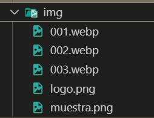
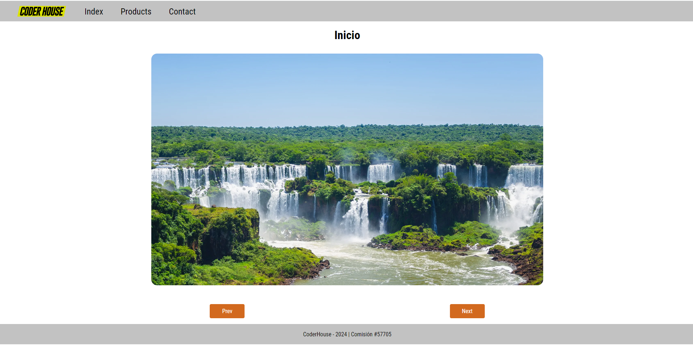

# Enunciado del Proyecto: Crear un Carousel de Imágenes
## Objetivo:
Desarrollar una galería de imágenes tipo "carousel" utilizando HTML, CSS y JavaScript. La galería debe permitir la navegación entre imágenes mediante botones de control "anterior" y "siguiente".

## Requisitos:
**Estructura HTML:**

Partiendo de la siguiente estructura HTML:

```html
<!DOCTYPE html>
<html lang="es-AR">

<head>
    <meta charset="UTF-8">
    <meta name="viewport" content="width=device-width, initial-scale=1.0">
    <link rel="icon" href="favicon.ico" type="image/x-icon">
    <link rel="stylesheet" href="css/style.css">
    <title>Javascript | Comisión #57705</title>
</head>

<body>
    <header id="header"></header>
    <main>
        <h1>Inicio</h1>
        <section id="gallery">
            <ul class="slide"></ul>
            <section class="botonera">
                <button class="control icon-prev">Prev</button>
                <button class="control icon-next">Next</button>
            </section>
        </section>
    </main>
    <footer></footer>
    <!-- Aca pongo los Script de JS -->
    <script src="js/navegacion.js"></script>
    <script src="js/index.js"></script>
    <!-- Scripts de JS  -->
</body>

</html>
```

El contenedor `.gallery` debe tener una lista de imágenes (pueden ser representadas por elementos `<li>`) usando como herramienta el manejo de `DOM` desde `JavasCript`.


**Estilo CSS:**

Diseñar la galería para que las imágenes se muestren en un formato adecuado, ocupando toda la anchura del contenedor.
Añadir botones de control para navegar a la imagen anterior y la siguiente.
Asegurarse de que la imagen actual esté visible y las demás imágenes estén ocultas.


**Funcionalidad JavaScript:**

Crear un array en JavaScript que contenga los nombres de las imágenes.
Utilizar JavaScript para generar dinámicamente los elementos `<li>` con las imágenes dentro del contenedor de la galería.


Implementar la funcionalidad para los botones de control que permita cambiar la imagen visible al hacer clic en "anterior" o "siguiente".

**Encontrarás imágenes de Ejemplo aquí:**



---

<p align="center"> 
    <a href="https://drako01.github.io/carrousel-js/">Ejemplo de como debería quedar

 
</p>
</a>

---

<p align="center"> 
    
</p>

<p align="center"> 
    <a href="https://developer.mozilla.org/en-US/docs/Web/JavaScript">Documentacion Oficial de JavaScript</a>
</p>