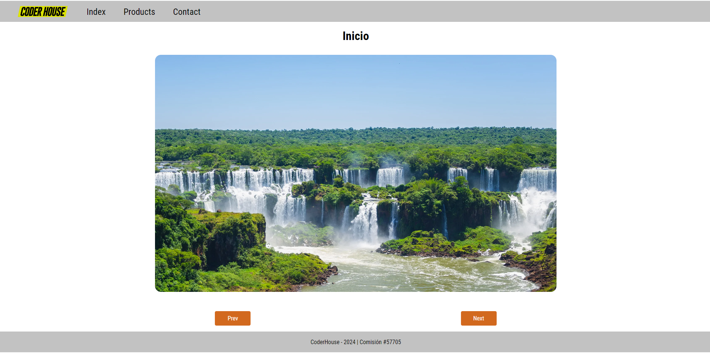

# Enunciado del Proyecto: Crear un Carousel de Imágenes
## Objetivo:
Desarrollar una galería de imágenes tipo "carousel" utilizando HTML, CSS y JavaScript. La galería debe permitir la navegación entre imágenes mediante botones de control "anterior" y "siguiente".

## Requisitos:
**Estructura HTML:**

Crear una estructura HTML básica que incluya un contenedor para la galería de imágenes.
El contenedor de la galería debe tener una lista de imágenes (pueden ser representadas por elementos `<li>`).

**Estilo CSS:**

Diseñar la galería para que las imágenes se muestren en un formato adecuado, ocupando toda la anchura del contenedor.
Añadir botones de control para navegar a la imagen anterior y la siguiente.
Asegurarse de que la imagen actual esté visible y las demás imágenes estén ocultas.

**Funcionalidad JavaScript:**

Crear un array en JavaScript que contenga los nombres de las imágenes.
Utilizar JavaScript para generar dinámicamente los elementos `<li>` con las imágenes dentro del contenedor de la galería.

Implementar la funcionalidad para los botones de control que permita cambiar la imagen visible al hacer clic en "anterior" o "siguiente".

 
    <a href="https://drako01.github.io/javascript---57705-pruebas/">Ejemplo de como debería quedar

 

</a>

 
    

 
    <a href="https://developer.mozilla.org/en-US/docs/Web/JavaScript">Documentacion Oficial de JavaScript</a>

